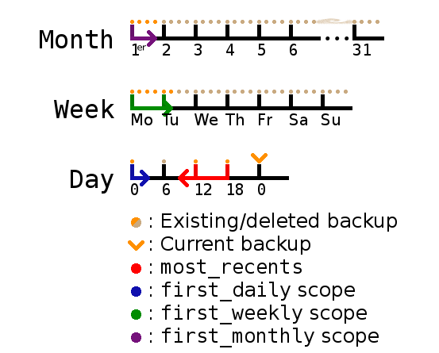

# Backupper

Un simple utilitaire de backup de fichiers configurable en YAML.

Voir `./backupper.py -h` pour l'utilisation de la commande.

backupfile.yml minimal :

```
backup_dir: /racine/du/dossier/de/sauvegarde
artifacts:
    - un/fichier
    - un/dossier
    - un/autre/dossier/
    - et/caetera
```

## Installation

```
    sudo ./setup.py install
    # ou, pour l'installer pour l'utilisateur courant
    ./setup.py install --user
```

## Référence du backupfile.yml

### `backup_dir`

* **Définition :** Spécifie le dossier dans lequel le répertoire du backup sera créé. Si le dossier n'existe pas, il sera créé.
* **Type :** chemin d'accès relatif ou absolu.
* **Obligatoire :** non, sauf si `delete_old_backups` vaut `true`.
* **Valeur par défaut :** le dossier courant.

### `delete_old_backups`

* **Définition :** Permet de supprimer les précédents backups du dossier de sauvegarde spécifié dans `backup_dir`. Si `cleaning_policy` n'est pas défini, par défaut tous les précédents backups sont supprimés.
* **Type :** booléen.
* **Obligatoire :** non.
* **Valeur par défaut :** `false`.

### `cleaning_policy`

* **Définition :** Permet de définir une politique fine de gestion des sauvegardes. Sans effet si `delete_old_backups` n'est pas défini ou vaut `false`. 
* **Type :** au moins un des paramètres ci-dessous.
* **Obligatoire :** non (en son absence, tous les anciens backups sont supprimés).

Chaque paramètre ci-dessous peut-être présent (au moins un). Le schéma ci-dessous explicite leur principe pour la _cleaning policy_ suivante :

```
cleaning_policy:
    most_recents: 2
    first_daily: 1
    first_weekly: 6
    first_monthly: 4
```



N.B. : Gardez bien à l'esprit que si vous augmentez l'un de ses paramètres d'un backup sur l'autre, vous ne retrouverez pas magiquement vos backups déjà supprimés. Nous vous conseillons donc de bien choisir ces valeurs.

#### `most_recents`

* **Définition :** Nombre de backups récents à garder (en plus du backup en cours).
* **Type :** entier positif ou nul.
* **Obligatoire :** non.
* **Valeur par défaut :** `0`.

#### `first_daily`

* **Définition :** Nombre de backups du jour en cours à garder (garde les n premiers backups du jour).
* **Type :** entier positif ou nul.
* **Obligatoire :** non.
* **Valeur par défaut :** `0`.

#### `first_weekly`

* **Définition :** Nombre de backups de la semaine en cours à garder (garde les n premiers backups de la semaine).
* **Type :** entier positif ou nul.
* **Obligatoire :** non.
* **Valeur par défaut :** `0`.

#### `first_monthly`

* **Définition :** Nombre de backups du mois en cours à garder (garde les n premiers backups du mois).
* **Type :** entier positif ou nul.
* **Obligatoire :** non.
* **Valeur par défaut :** `0`.

### `artifacts`

* **Définition :** Spécifie la liste des fichiers et dossiers à sauvegarder.
* **Type :** liste de chemins d'accès relatifs ou absolus.
* **Obligatoire :** oui.
